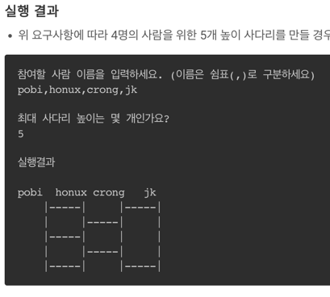

# 사다리 게임
## 진행 방법
* 사다리 게임 게임 요구사항을 파악한다.
* 요구사항에 대한 구현을 완료한 후 자신의 github 아이디에 해당하는 브랜치에 Pull Request(이하 PR)를 통해 코드 리뷰 요청을 한다.
* 코드 리뷰 피드백에 대한 개선 작업을 하고 다시 PUSH한다.
* 모든 피드백을 완료하면 다음 단계를 도전하고 앞의 과정을 반복한다.

## 온라인 코드 리뷰 과정
* [텍스트와 이미지로 살펴보는 온라인 코드 리뷰 과정](https://github.com/nextstep-step/nextstep-docs/tree/master/codereview)

## 요구사항 명세서

###  LadderConnectOrder

**기능**
* 사다리와 사다리를 연결할 지 결정하는 정보를 가지고 있는 객체 입니다.
* 사다리를 연결한 뒤의 연결 정보(Point)를 반환합니다.

**테스트**
* 사용자수보다 한 개 적은 크기를 가집니다.
* 사다리를 연결한 뒤 Point의 크기와 LadderConnectOrder는 동일해야합니다.

###  Line
**기능**
* 사다리와 사다리가 연결되어 있는지 상태값이 담겨있는 객체입니다
* n번째 줄에서 m번째 사다리가 m - 1번째 사디리와 연결되어 있다면 m + 1번재 사다리와는 연결될수 없습니다.
* userIndex가 오른쪽으로 움직일 수 있는지의 여부를 반환합니다.
* userIndex가 왼쪽으로 움직일 수 있는지의 여부를 반환합니다.

**테스트**
* 한 라인의 상태 개수는 사람의 수보다 하나 작게 생성되어야 합니다.
* Line은 사람의 수보다 하나 작게 생성되어야 합니다.
* Line에 두 개의 사다리가 연결된 경우 예외가 발생해야 합니다.
* Line은 UserIndex를 오른으로 이동가능한지 판단합니다.
* Line의 가장 오른쪽에 사용자가 위치한 경우 오른쪽으로 이동할 수 없습니다.
* Line은 사용자가 왼쪽으로 이동 가능한지 판단합니다.
* Line의 가장 왼쪽에 사용자가 위치한 경우 왼쪽으로 이동할 수 없습니다.

### Lines
**기능**
* List<Line>을 상태로 가지고있는 일급 컬렉션입니다.
* LInes는 사다리 높이만큼 크기를 가지고 있습니다.

**테스트**
* Lines는 사다리 높이만큼 크기를 가지고 있습니다.
* 전달받은 사다리 높이가 1도다 작을 경우 예외가 발생해야 합니다.
* 사용자의 당첨결과 인덱스를 조회해야 합니다.

### MoveDirection
**기능**
* 사용자의 위치값을 증감 시키는 객체입니다

**테스트**
* 현재 위치에서 오른쪽으로 이동할 경우 현재 위치값이 증가해야합니다.
* 현재 위치에서 왼쪽으로 이동할 경우 현재 위치값이 감소해야합니다.
* 현재 위치에서 이동하지 않을 경우 현재 위치값이 변하지 않아야 합니다.

### LadderResult
**기능**
* 사용자의 사다리타기 결과값을 가지고 있는 객체입니다.
* 사다리타기 결과값을 계산합니다.
* 사용자의 당첨 결과를 조회합니다.

**테스트**
* 당첨된 User를 조회해야합니다.
* 존재하지 않은 사용자에 대해서 당첨 조회를 할 경우 예외가 발생해야 합니다.
* 사용자의 개수와 결과 개수가 불일치할 경우 예외가 발생해야 합니다.

### Point
**기능**
* 사다리와 사다리가 연결되어있는지에 대한 정보를 가지고 있는 객체입니다.
* LadderConectOrder가 전달될 경우 사다리와 사다리를 연결합니다.
* 이전에 사다리를 연결하지 않았고 LadderConnectOrder가 True라면 사다리와 사다리를 연결합니다.
* 이전에 사다리를 연결하지 않았고 LadderConnectOrder가 False라면 사다리와 사다리를 연결하지 않습니다.
* 이전에 사다리를 연결하였고 LadderConnectOrder가 True라면 사다리와 사다리를 연결하지 않습니다.

**테스트**
* 자신의 상태가 True인지 반환합니다.
* 자신의 상태가 False인지 반환합니다.
* 이름이 null, 공백, 공백을 제외한 길이가 0인경우 예외가 발생해야 합니다.

### User
**기능**
* 사용자의 이름을 가지고 있습니다.

**테스트**
* 이름이 null, 공백, 공백을 제외한 길이가 0인경우 예외가 발생해야 합니다. 

### Users
**기능**
* User를 List로 가지는 일급 컬렉션입니다.
* 사용자 Index를 통해 사용자를 조회합니다.

**테스트**
* 사용자 Index를 통해 사용자를 조회합니다.
* users는 자신의 크기를 반환해야 합니다.
* users는 크키가 0일 경우 예외가 발생해야 합니다.
