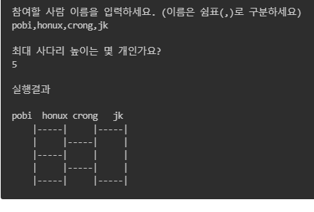

# 사다리 게임
## 진행 방법
* 사다리 게임에 참여하는 사람에 이름을 최대5글자까지 부여할 수 있다. 사다리를 출력할 때 사람 이름도 같이 출력한다.
* 사람 이름은 쉼표(,)를 기준으로 구분한다.
* 사람 이름을 5자 기준으로 출력하기 때문에 사다리 폭도 넓어져야 한다.
* 사다리 타기가 정상적으로 동작하려면 라인이 겹치지 않도록 해야 한다.
* |-----|-----| 모양과 같이 가로 라인이 겹치는 경우 어느 방향으로 이동할지 결정할 수 없다.
## 기능 요구사항
### 사다리게임
* [X] 사다리 게임 참여 인원을 입력받는다.
  * [X] 사람 이름은 쉼표(,)를 기준으로 구분한다.
  * [X] 사람 이름은 5자 이하만 가능하다.
  * [X] 사람 이름은 공백일 수 없다.
  * [X] 참여할 사람은 2명 이상이어야 한다.
* [X] 결과를 입력한다.
  * [X] 결과는 쉼표(,)를 기준으로 구분한다.
  * [X] 결과는 참가인원만큼 입력해야 한다.
  * [X] 참여인원보다 적거나 많으면 안된다.
* [X] 사다리 높이를 입력받는다.
  * [X] 사다리 높이는 자연수이며 1이상일때 동작한다. 
### 사다리 생성
* [X] 사다리 높이에 맞게 사다리를 출력해야 한다.
* [X] 사다리를 생성한다.
  * [X] 사다리는 가로라인에 연속된 결과가 없어야 한다. 
### 결과
* 사다리 결과
  * [X] 이름을 출력한다.
  * [X] 생성한 사다리를 출력한다.
  * [X] 결과를 출력한다.
* 결과를 볼 사람을 입력한다.
  * [X] 특정 사람 이름을 입력하면 해당 사람의 당첨 결과를 출력한다.
  * [X] all을 입력하면 모든 사람의 당첨 결과를 출력한다.
  

### 프로그래밍 요구사항
- 자바8의 스트림, 람다를 사용해 함수형 프로그래밍하는 경험
- In -> Out, Out -> In 방식으로 도메인 객체를 설계하는 경험
- 책임주도설계 기반으로 인터페이스 활용해 프로그래밍하는 연습
- 규칙 4: 한 줄에 점을 하나만 찍는다.
- Clean Code 가이드의 디미터 법칙을 지키는 것을 의미한다.
- 규칙 6: 모든 엔티티를 작게 유지한다.
- 규칙 7: 3개 이상의 인스턴스 변수를 가진 클래스를 쓰지 않는다.
- 규칙 9: 게터/세터/프로퍼티를 쓰지 않는다.
## 온라인 코드 리뷰 과정
* [텍스트와 이미지로 살펴보는 온라인 코드 리뷰 과정](https://github.com/nextstep-step/nextstep-docs/tree/master/codereview)