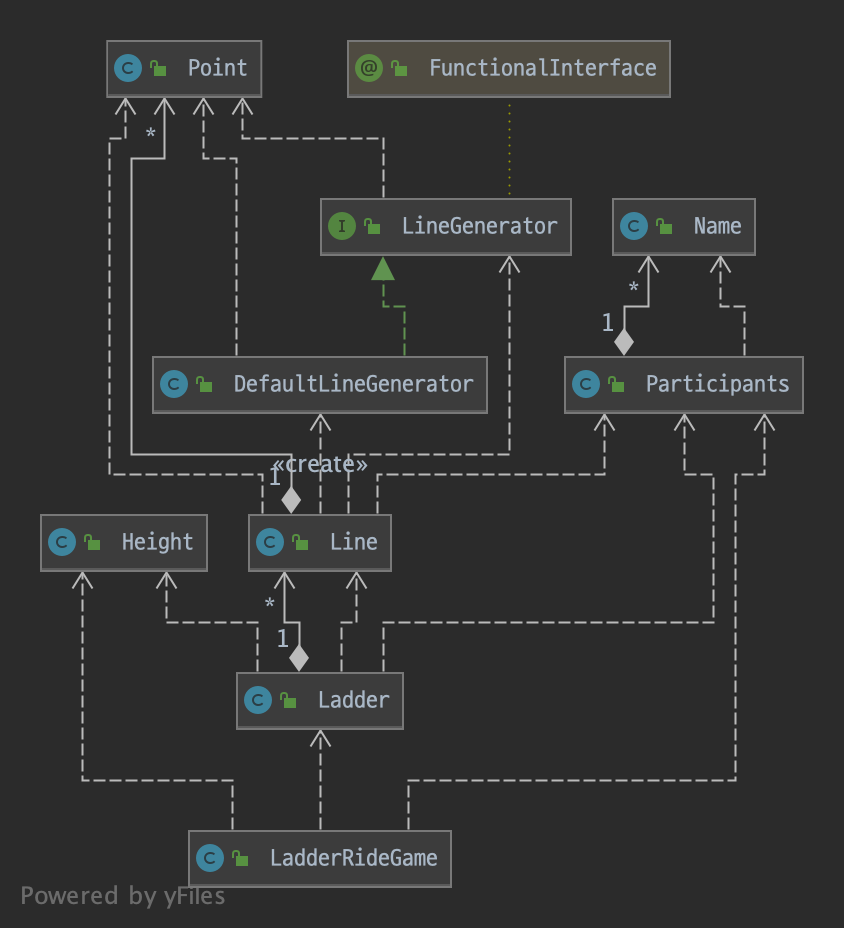
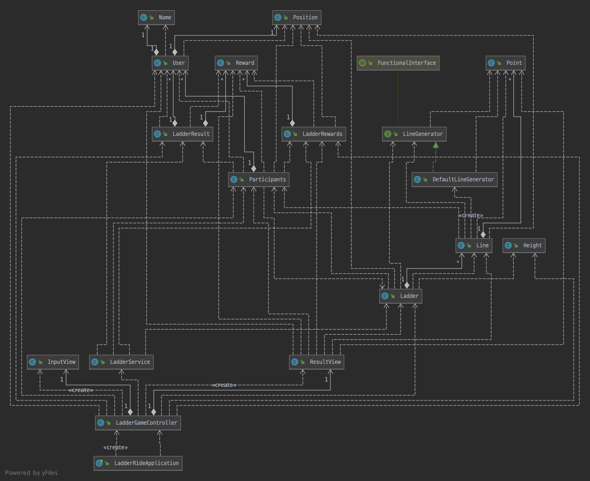
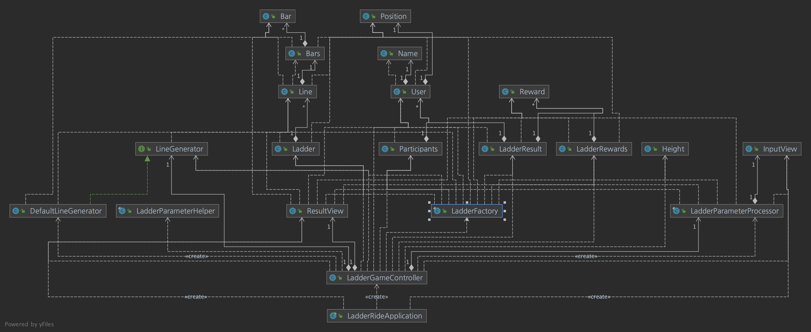

# 사다리 게임
## 진행 방법
* 사다리 게임 게임 요구사항을 파악한다.
* 요구사항에 대한 구현을 완료한 후 자신의 github 아이디에 해당하는 브랜치에 Pull Request(이하 PR)를 통해 코드 리뷰 요청을 한다.
* 코드 리뷰 피드백에 대한 개선 작업을 하고 다시 PUSH한다.
* 모든 피드백을 완료하면 다음 단계를 도전하고 앞의 과정을 반복한다.

## 온라인 코드 리뷰 과정
* [텍스트와 이미지로 살펴보는 온라인 코드 리뷰 과정](https://github.com/nextstep-step/nextstep-docs/tree/master/codereview)

## 1단계 - 자바8, 스트림, 람다, Optional

- `람다`와 `클로저`
    - `람다`는 `익명 함수`의 다른 표현
    - 함수는 함수인데 이름이 없는 경우

### 람다(lambda)
- `익명 클래스`로 구현된 코드를 `람다`로 수정
- `람다`를 활용한 중복 데이터 제거

- 힌트
  - `변경되는 부분`과 `변경되지 않는 부분`의 코드를 분리한다.
  - `변경되는 부분`을 인터페이스로 추출한다.
  - `인터페이스`에 대한 `구현체`를 `익명 클래스(anonymous class)`로 구현해 `메소드의 인자`로 전달한다.
  - 구글에서 자바의 익명 클래스로 검색해 `익명 클래스`가 무엇인지 학습한다.

### 스트림(stream)
- map, filter, reduce
- 앞으로는 순회하는 것을 잊고, Element 처리에만 집중하자.

- 실습 1
  - List에 담긴 모든 숫자 중 `3보다 큰 숫자`를 `2배` 한 후 `모든 값의 합`을 구한다. 
  - 지금까지 학습한 `map`, `reduce`, `filter`를 활용해 구현해야 한다.

- 실습 2
  - `단어의 길이가 12자를 초과`하는 단어를 추출한다.
  - 12자가 넘는 단어 중 `길이가 긴 순서로 100개`의 단어를 추출한다.
  - `단어 중복을 허용하지 않는다`. 즉, `서로 다른 단어 100개`를 추출해야 한다.
  - 추출한 100개의 단어를 출력한다. `모든 단어는 소문자로 출력`해야 한다.

### Optional
- `요구사항1: Optional을 활용해 조건에 따른 반환`
  - ageIsInRange1() 메소드는 `30살 이상, 45살 이하`에 해당하는 `User가 존재하는 경우 true를 반환`하는 메소드
  
  - 힌트
    - [Guide To Java 8 Optional](https://www.baeldung.com/java-optional) 문서를 참고해 Optional 사용 방법을 익힌다.
    - Optional.ofNullable(user)을 활용해 User을 Optional로 생성하는 것이 가능하다.
    - Optional의 map(), filter() 메소드등을 활용해 필요한 데이터를 추출
    - Optional의 isPresent() 메소드 활용

- `요구사항2: Optional에서 값을 반환`
  - getUser() 메소드를 자바 8의 stream과 Optional을 활용해 구현
  - 자바 8의 stream과 Optional을 사용하도록 리팩토링

  - 힌트
    - [Guide To Java 8 Optional](https://www.baeldung.com/java-optional) 문서를 참고해 Optional 사용 방법을 익힌다.
    - Optional의 orElse() 메소드 활용해 구현한다.
  

- `요구사항3: Optional에서 exception 처리`
  - Expression의 of 메소드를 구현
  - 단, of 메소드를 구현할 때 자바 8의 stream을 기반으로 구현한다.

  - 힌트
    - [Guide To Java 8 Optional](https://www.baeldung.com/java-optional) 문서를 참고해 Optional 사용 방법을 익힌다.
    - 자바의 `enum` 전체 값은 `values()` 메소드를 통해 배열로 접근 가능하다.
    - `Arrays.stream()`을 이용해 배열을 stream으로 생성할 수 있다.
    - 일치하는 값 하나를 추출할 때 `findFirst()` 메소드를 활용 가능하다.
    - Optional의 `orElseThrow()` 메소드 활용해 구현한다.

## 2단계 - 사다리 (생성)
- 기능 요구사항
  - 사다리 게임에 참여하는 사람에 이름을 최대5글자까지 부여할 수 있다. 사다리를 출력할 때 사람 이름도 같이 출력한다.
  - 사람 이름은 쉼표(,)를 기준으로 구분한다.
  - 사람 이름을 5자 기준으로 출력하기 때문에 사다리 폭도 넓어져야 한다.
  - 사다리 타기가 정상적으로 동작하려면 라인이 겹치지 않도록 해야 한다.
    - |-----|-----| 모양과 같이 가로 라인이 겹치는 경우 어느 방향으로 이동할지 결정할 수 없다.

- 프로그래밍 요구사항
  - 자바 8의 스트림과 람다를 적용해 프로그래밍한다.
  - 규칙 6: 모든 엔티티를 작게 유지한다.

- 실행 결과
```text
참여할 사람 이름을 입력하세요. (이름은 쉼표(,)로 구분하세요)
pobi,honux,crong,jk

최대 사다리 높이는 몇 개인가요?
5

실행결과

pobi  honux crong   jk
    |-----|     |-----|
    |     |-----|     |
    |-----|     |     |
    |     |-----|     |
    |-----|     |-----|
```

- 힌트
  - 2차원 배열을 ArrayList, Generic을 적용해 구현하면 ArrayList<ArrayList<Boolean>>와 같이 이해하기 어려운 코드가 추가된다.
  - 사다리 게임에서 한 라인의 좌표 값을 가지는 객체를 추가해 구현해 본다.

```java
public class Line {
    private List<Boolean> bars = new ArrayList<>();

    public Line (int countOfPerson) {
        // 라인의 좌표 값에 선이 있는지 유무를 판단하는 로직 추가
    }
    // ...
}
```

- 생각나는 추가 조건
  - 게임은 2명 이상이어야 사다리가 만들어진다.
  - 높이는 1이상만 가능하다.

- 요구사항 스케치
  - 참여자 -> 이름
  - 사다리높이
  - 참여자 + 사다리 높이 -> 사다리
  
- Line 만들기

  ```text
    user1 user2 user3
    |-----|-----|
    |-----|-----|
  ```

- 다시 생각하기
  - 라인이 겹치지 않도록 해야 한다.
  - 라인을 중복하지않게 하기 위한 방법 최선인가?



> 사다리(생성) 1차 피드백

- [x] [문자열 상수 관리](https://github.com/next-step/java-ladder/pull/841#discussion_r606647457)
- [x] [메서드 명에 대한 정의](https://github.com/next-step/java-ladder/pull/841#discussion_r606647603)
- [x] [메서드 명에 대한 정의 2](https://github.com/next-step/java-ladder/pull/841#discussion_r606647666) 
- [x] [객체의 책임 확인](https://github.com/next-step/java-ladder/pull/841#discussion_r606647697)

## 3단계 - 사다리(게임 실행)

- 기능 요구사항
  - 사다리 실행 결과를 출력해야 한다.
  - 개인별 이름을 입력하면 개인별 결과를 출력하고, "all"을 입력하면 전체 참여자의 실행 결과를 출력한다.

- 프로그래밍 요구사항
  - 자바 8의 스트림과 람다를 적용해 프로그래밍한다.
  - 규칙 6: 모든 엔티티를 작게 유지한다.
  - 규칙 7: **3개 이상의 인스턴스 변수를 가진 클래스를 쓰지 않는다.**

- 게임 화면
```text
참여할 사람 이름을 입력하세요. (이름은 쉼표(,)로 구분하세요)
pobi,honux,crong,jk

실행 결과를 입력하세요. (결과는 쉼표(,)로 구분하세요)
꽝,5000,꽝,3000

최대 사다리 높이는 몇 개인가요?
5

사다리 결과

pobi  honux crong   jk
    |-----|     |-----|
    |     |-----|     |
    |-----|     |     |
    |     |-----|     |
    |-----|     |-----|
꽝    5000  꽝    3000

결과를 보고 싶은 사람은?
pobi

실행 결과
꽝

결과를 보고 싶은 사람은?
all

실행 결과
pobi : 꽝
honux : 3000
crong : 꽝
jk : 5000
```
- 힌트
  - 각 로직을 구현하기 위해 필요한 데이터를 가지는 객체를 분리하기 위해 노력해본다. 
  - 로직 구현에 필요한 데이터를 가지는 객체를 잘 분리하면 의외로 쉽게 문제를 해결할 수 있다.
  - 각 객체가 2개 이하의 인스턴스 변수만을 가지도록 구현해 본다.

- 코드 구현 전 시나리오 작성하기
  1. 실행보상(LadderRewards) 입력
    - 결과 값 받아서 쉼표 기준으로 split 처리 후 result에 전달하기
  2. 사다리결과 출력
    - 이름 -> 사다리 -> 결과값 순서대로 출력
  3. 결과를 보고 싶은 사람 출력
    - 참여자 내에 존재하는지 확인, **실제 사다리 타기** 
  4. 실행 결과(LadderResult) 출력
    - 결과 보고 싶은 사람 입력으로 계산된 결과 값 출력
  5. 결과를 보고 싶은 사람 출력
    - 전체 all 출력 
  6. 실행 결과 전체 출력
    - 전체 결과 값 출력

- 사다리 타기 로직 필요한 내용 살펴보기
  - 이동에 대한 값을 관리할 객체의 필요성을 느낌 -> Position
  - 참여자의 `시작 위치`를 설정하는 것이 필요할 것 같다. -> User(name, Position)
  - Ladder의 List<Line>을 모두 반복한 뒤 결과 index를 저장하여 매핑된 사다리 보상과 매핑해야할 듯

```text
    user1   user2   user3
false   | true  | false |
false   | false | true  |
```




> 사다리 타기 3단계 피드백

- [x] [AtomicInteger의 사용 이유](https://github.com/next-step/java-ladder/pull/859#discussion_r607832479)
- [x] [메서드명 정의](https://github.com/next-step/java-ladder/pull/859#discussion_r607838227)
- [x] [객체의 책임](https://github.com/next-step/java-ladder/pull/859#discussion_r607842860)
- [x] [인터페이스 활용](https://github.com/next-step/java-ladder/pull/859#discussion_r607845484)




## 사다리 타기 피드백
- Ladder를 작은 단위로 쪼갠다.
  - Line (List<Point>)
    - Point (boolean)
      - Point는 그 자체 만으로 의미를 갖는지? -> 처음부터 객체를 구성했다면 도메인에 대한 이해가 높았을 것이다.

- Cyclic dependency 를 해결하는 방법
  - FactoryBean 역할을 하는 클래스를 만들어야 한다.
