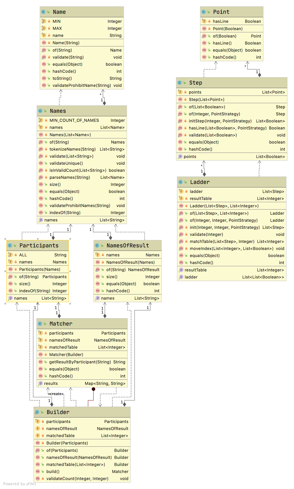

# 사다리 실행 결과를 출력

## step02 피드백
- Collections.unmodifiableList
- 중첩 forEach

## 기능 정의
기능들을 계속 바꾸면서 docs 에서 바뀌는 것이 생긴 메서드의 인터페이스를 적는 것 밖에 없더라고요. 이 기능은 인텔리제이 uml diagram 으로 대체 가능할 것 같아서 
적지 않았습니다. 

다음에는 기능을 정의할 때 테스트 케이스 DisplayName 에 다가 정의하는 것이 어떨까 생각하고 있습니다. 



## 기능 요구사항
개인별 이름을 입력하면 개인별 결과를 출력하고, 
"all"을 입력하면 전체 참여자의 실행 결과를 출력한다.

## 프로그래밍 요구사항
자바 8의 스트림과 람다를 적용해 프로그래밍한다.

규칙 6: 모든 엔티티를 작게 유지한다.

규칙 7: 3개 이상의 인스턴스 변수를 가진 클래스를 쓰지 않는다.

## 실행 결과
위 요구사항에 따라 4명의 사람을 위한 5개 높이 사다리를 만들 경우, 
프로그램을 실행한 결과는 다음과 같다.

```
참여할 사람 이름을 입력하세요. (이름은 쉼표(,)로 구분하세요)
pobi,honux,crong,jk

실행 결과를 입력하세요. (결과는 쉼표(,)로 구분하세요)
꽝,5000,꽝,3000

최대 사다리 높이는 몇 개인가요?
5

사다리 결과

pobi  honux crong   jk
    |-----|     |-----|
    |     |-----|     |
    |-----|     |     |
    |     |-----|     |
    |-----|     |-----|
꽝    5000  꽝    3000

결과를 보고 싶은 사람은?
pobi

실행 결과
꽝

결과를 보고 싶은 사람은?
all

실행 결과
pobi : 꽝
honux : 3000
crong : 꽝
jk : 5000
```
## 힌트
각 로직을 구현하기 위해 필요한 데이터를 가지는 객체를 분리하기 위해 노력해본다. 
로직 구현에 필요한 데이터를 가지는 객체를 잘 분리하면 의외로 쉽게 문제를 해결할 수 있다.

각 객체가 2개 이하의 인스턴스 변수만을 가지도록 구현해 본다.
